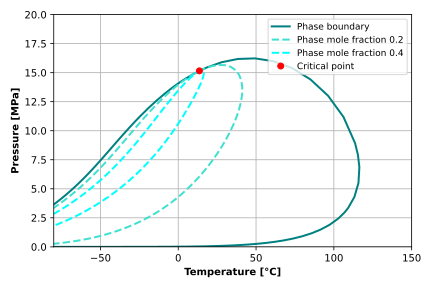

# Reservoir Simulation

ReSim is a library written in Python and Fortran for fluid phase equilibria and PVT-experiments calculation, as well as for compositional reservoir simulation. It is currently under development.

For now, this repository allows users to perform phase equilibria routines for PT-based thermodynamics, such as stability tests, two- and multiphase flash calculations, determination of saturation pressure or temperature, cricondenbar or cricondentherm, and construction of two-phase envelopes for multicomponent mixtures. Critical point calculation for VT-based thermodynamics is also implemented.

Using this library, one can simulate some laboratory experiments, such as Constant Volume Depletion (CVD), Constant Composition Expansion (CCE), Differential Liberation (DL), swelling experiments (first-contact miscibility), and separator tests.

Currently, only the modified Peng-Robinson (1978) equation of state \[D.B. Robinson and D.Y. Peng, 1978\] is supported.

## Installation

Since this library is under development, it can be installed by [cloning the repository](https://docs.github.com/en/repositories/creating-and-managing-repositories/cloning-a-repository) from GitHub. Once cloned, install the library in editable mode using the following command: [`pip install -e .`](https://pip.pypa.io/en/stable/cli/pip_install/#cmdoption-e) command.

This library only depends on [NumPy](https://numpy.org/) and built-in python libraries.

## Quick Start

This is a short introduction to phase equilibria calculations and PVT experiment simulation using ReSim.

Equations of state in ReSim are classes. To perform calculations for a given mixture, an equation of state object must first be initialized for that mixture. The following code initializes a modified Peng-Robinson EOS object for a mixture of methane, ethane, propane, normal butane, and a heavy components fraction.

```python
import numpy as np

# Components: CH₄, C₂H₆, C₃H₈, nC₄H₁₀, C₅₊.

# Critical pressures in [Pa].
Pci = np.array([4.599e6, 4.872e6, 4.248e6, 3.796e6, 2.398e6])
# Critical temperatures in [K].
Tci = np.array([190.56, 305.32, 369.83, 425.12, 551.02])
# Acentric factors.
wi = np.array([0.012, 0.100, 0.152, 0.200, 0.414])
# Molar weights in [kg/mol].
mwi = np.array([0.016043, 0.03007, 0.044097, 0.058123, 0.120])
# Volume shift coefficients.
s0i = np.array([-0.1595, -0.1134, -0.0863, -0.0675, 0.05661])
# Binary interaction coefficients as the lower triangle matrix.
dij = np.array([
  0.002689,
  0.008537, 0.001662,
  0.014748, 0.004914, 0.000866,
  0.039265, 0.021924, 0.011676, 0.006228,
])

from resim.pvt.eos import pr78

eos = pr78(Pci, Tci, wi, mwi, dij, s0i)
```

The following code computes the compressibility factor of the mixture:

```python
# Pressure in [Pa].
P = 15e6
# Temperature in [K].
T = 70. + 273.15
# Mole composition of the mixture.
yi = np.array([0.72, 0.10, 0.08, 0.06, 0.04])

print(eos.getPT_Z(P, T, yi))
```

```
0.6986113469413198
```

There are other methods in this class that compute not only the compressibility factor and natural logarithms of fugacity coefficients, but also their derivatives with respect to pressure, temperature, and mole numbers. Methods for phase identification and K-value generation are also available. For more details, see the documentation of this class.

To calculate the properties of a mixture and evaluate its stability as a single phase, use the stability test procedure:

```python
from resim.pvt.stab import stabtest

state = stabtest.runPT(eos, P, T, yi)

print(state)
```

```
Pressure: 15.000 [MPa].
Temperature: 70.00 [°C].
Volume: 1.329e-04 [m³].
Mole number: 1.0000 [mol].
Phase IDs: [0].
Phase mole fractions: [1.].
Phase volume fractions: [1.].
Phase mass densities: [198.472] [kg/m³].
```

Single-phase stability is determined by the absence of K-values in a state object.

```python
print(f'The one phase is stable: {state.kvji is None}.')
```

```
The one phase is stable: False.
```

Since the single-phase state is unstable, a flash procedure should be performed to determine the equilibrium multiphase state.

```python
from resim.pvt.flash import flash

state = flash.runNpPT(eos, P, T, yi)

print(state)
```

```
Pressure: 15.000 [MPa].
Temperature: 70.00 [°C].
Volume: 1.340e-04 [m³].
Mole number: 1.0000 [mol].
Phase IDs: [1 0].
Phase mole fractions: [0.0401 0.9599].
Phase volume fractions: [0.0312 0.9688].
Phase mass densities: [404.426 190.116] [kg/m³].
```

The two-phase liquid-gas state is the equilibrium state. For a given temperature and composition, you can also determine the saturation pressure:

```python
from resim.pvt.psat import psat

state = psat.runPT(eos, T, yi, upper=True)

print(state)
```

```
Pressure: 15.585 [MPa].
Temperature: 70.00 [°C].
Volume: 1.285e-04 [m³].
Mole number: 1.0000 [mol].
Phase IDs: [1 0].
Phase mole fractions: [0. 1.].
Phase volume fractions: [0. 1.].
Phase mass densities: [388.354 205.225] [kg/m³].
```

We can also calculate and plot the two-phase envelope for the mixture:

```python
from resim.pvt.env import env2p

Tmin = -80. + 273.15
Tmax = 150. + 273.15
Pmax = 20e6

env00 = env2p.runPT(eos, yi, 0.0, 0.+273.15, Pmax=Pmax, Tmin=Tmin, Tmax=Tmax)
env02 = env2p.runPT(eos, yi, 0.2, 0.+273.15, Pmax=Pmax, Tmin=Tmin, Tmax=Tmax)
env04 = env2p.runPT(eos, yi, 0.4, 0.+273.15, Pmax=Pmax, Tmin=Tmin, Tmax=Tmax)

from matplotlib import pyplot as plt

fig, ax = plt.subplots(1, 1, figsize=(6., 4.), tight_layout=True)
ax.plot(env00.T - 273.15, env00.P / 1e6, ls='-', lw=2., c='teal',
        zorder=2, label='Phase boundary')
ax.plot(env02.T - 273.15, env02.P / 1e6, ls='--', lw=2., c='turquoise',
        zorder=2, label='Phase mole fraction 0.2')
ax.plot(env04.T - 273.15, env04.P / 1e6, ls='--', lw=2., c='cyan',
        zorder=2, label='Phase mole fraction 0.4')
ax.plot(env00.Tc - 273.15, env00.Pc / 1e6, 'o', c='r', zorder=3,
        label='Critical point')
ax.set_xlim(-80., 150.)
ax.set_ylim(0., 20.)
ax.set_xlabel('Temperature [°C]', fontweight='bold')
ax.set_ylabel('Pressure [MPa]', fontweight='bold')
ax.grid(zorder=1)
ax.legend(loc=1, fontsize=9.)
plt.show()
```



The following example demonstrates the calculation of the CVD experiment. We define a custom reporting class to calculate the black-oil properties of the phases at each stage of the CVD experiment. The gas phase from a cell is sent to the low-temperature separation, after which its properties are calculated in the form of the black-oil model. The liquid phase separated during the CVD experiment is sent to single-stage separation under standard conditions, after which its properties are calculated in the form of the black-oil model.

```python
from functools import partial
from resim.pvt.lab import cvd, BoState
from resim.pvt.sep import ltsep, stsep

# Custom reporting class to capture the fluid state at each CVD stage.
# It simulates the low-temperature separator for gas phase properties
# and the standard separator for the liquid phase.
class RepState(BoState):
  gassep: partial(ltsep, flashroutine=flash.run2pPT)
  liqsep: partial(stsep, flashroutine=flash.run2pPT)
  pass

# Depletion pressure stages [Pa] for the CVD experiment.
PP = np.array([17120., 12670., 7180., 3210., 1590., 101.]) * 1e3

# Execute CVD simulation using the two-phase PT-flash procedure.
res = cvd(eos, PP, T, yi, flashroutine=flash.run2pPT, repstate=RepState)

# Print calculated results as a table.
print(f'{res:r}')
```

```
Stage  P [MPa]  T [°C]   V [m³]  n [mol]  PID  s [fr.]  ρ [kg/rm³]  b [rm³/sm³]  r [sm³/sm³]   μ [cP]  PID  s [fr.]  ρ [kg/rm³]  b [rm³/sm³]  r [sm³/sm³]   μ [cP]
    0   15.585   70.00  1.3e-04   1.0000    1   0.0000      388.35      4.68535    9.270e+02  -1.0000    0   1.0000      205.23      0.00548    1.323e-04  -1.0000
    1   12.670   70.00  1.6e-04   1.0000    1   0.0606      455.58      3.10399    5.364e+02  -1.0000    0   0.9394      143.86      0.00700    2.075e-06  -1.0000
    2    7.180   70.00  2.5e-04   0.7999    1   0.0361      552.62      1.88574    2.155e+02  -1.0000    0   0.9639      69.228      0.01379    0.000e+00  -1.0000
    3    3.210   70.00  3.2e-04   0.4361    1   0.0203      624.36      1.33689    7.118e+01  -1.0000    0   0.9797      29.063      0.03382    0.000e+00  -1.0000
    4    1.590   70.00  2.8e-04   0.1975    1   0.0194      657.33      1.16092    2.598e+01  -1.0000    0   0.9806      14.714      0.07114    0.000e+00  -1.0000
    5    0.101   70.00  2.9e-03   0.1082    1   0.0002      696.54      1.05793    0.000e+00  -1.0000    0   0.9998      1.6811      1.50610    1.899e-03  -1.0000
```

In the Phase ID (PID) columns of the table above, the gas and liquid phases are labeled `0` and `1`, respectively.

Other examples can be found in the `tests` folder of each procedure's directory.

If you encounter an error, you can use the built-in [`logging`](https://docs.python.org/3/library/logging.html) library to see calculation details. Examples for setting up a logger are also provided in the `tests` folders.

The codebase is fully typed. You can find a `protocols.py` file in each directory; these types help clarify which attributes and methods are required to run the code.

Each function and class includes a description in its docstring (via the `__doc__` attribute). If anything is unclear, please let us know.

## Course Materials

This repository also contains source files for a course on the basics of reservoir simulation. The course covers the development of a customized, multidimensional, equation-of-state (EOS) compositional reservoir simulator—moving from the basics of linear algebra and thermodynamics to solving volume balance, heat, and mass transfer equations in discretized space and time.

The curriculum is designed to help students understand the physics "under the hood" of compositional simulators rather than focusing on high-performance computing. However, it does include examples of numerical algorithms implemented in Python and Fortran.

Course materials are available at this [link](https://danielskorov.github.io/ReservoirSimulation/). Please note that these materials are currently being refactored and updated. They were originally written in Russian but are in the process of being translated into English; we appreciate your patience if you encounter any errors during this transition.

## Contributing

Contributions are welcome via **Pull Requests**. You are also encouraged to open an **Issue** if you find a typo or mistake. Additionally, feel free to ask questions or start a conversation in **GitHub Discussions**.

### Editing Course Content
The course content is authored in Markdown (`.md` files) and is located in the `/doc/theory/` folder. To render these source files into `.html` pages locally, you will need to install the following dependencies: [Jupyter Book](https://jupyterbook.org/), [NumPy](https://numpy.org/), [SciPy](https://scipy.org/), [Matplotlib](https://matplotlib.org/) (or matplotlib-base), and [iapws](https://iapws.readthedocs.io/).

The course materials are built using Jupyter Book with custom modifications (located in the `/doc/_static/` folder). The `gh-pages` branch contains the final rendered HTML.

### Working with Fortran
This project uses [`numpy.f2py`](https://numpy.org/doc/stable/f2py/) to call Fortran subroutines from Python. This extension automatically builds and compiles modules that can be imported directly into Python code. To run `f2py`, you will need [`meson`](https://github.com/mesonbuild/meson) and [`ninja`](https://github.com/ninja-build/ninja).

*   **Linux:** Installing [`gfortran`](https://gcc.gnu.org/fortran/) is straightforward; follow the guide at [fortran-lang.org](https://fortran-lang.org/ru/learn/os_setup/install_gfortran/#linux).
*   **Windows:** The setup is more involved. You can install `gfortran` via [`mingw-w64`](https://www.mingw-w64.org/) as recommended by the [official f2py manual](https://numpy.org/devdocs/f2py/windows/index.html), or use the libraries provided by [`winlibs`](https://www.winlibs.com/).

If you encounter errors regarding missing `.dll` files when importing compiled Fortran code, please refer to [this issue comment](https://github.com/numpy/numpy/issues/28151#issuecomment-2720506610) for a solution.

## Future Plans

The following features and improvements are planned for the near future:

*   **Advanced Mixing Rules:** Refactoring the Peng-Robinson class to support E-PPR78 \[[J.-N. Jaubert et al, 2022](https://doi.org/10.1016/j.fluid.2022.113456)\], Huron-Vidal \[[M.-J. Huron and J. Vidal, 1979](https://doi.org/10.1016/0378-3812(79)80001-1)\], Wong-Sandler \[[D.S.H. Wong and S.I. Sandler, 1992](https://doi.org/10.1002/aic.690380505)\]), and custom mixing rules.
*   **Performance Optimization:** Migrating EOS classes, stability tests, flash routines, and other solvers to Fortran.
*   **New Equations of State:** Implementation of eCPA \[[B. Maribo-Mogensen et al, 2015](https://doi.org/10.1002/aic.14829)\] and ePC-SAFT \[[M. Bulow et al, 2021](https://doi.org/10.1016/j.fluid.2021.112967); [M. Bulow et al, 2021](https://doi.org/10.1016/j.fluid.2021.112989)\].
*   **VT-based Thermodynamics:** Implementation of VT-based stability tests and flash calculations \[[D.V. Nichita, 2017](http://doi.org/10.1016/j.fluid.2017.05.022); [D.V. Nichita, 2017](https://doi.org/10.1016/j.fluid.2017.10.030); [D.V. Nichita, 2017](https://doi.org/10.1016/j.fluid.2017.12.021); [D.V. Nichita, 2018](https://doi.org/10.1016/j.fluid.2018.03.012)\].
*   **Component Library:** Adding a built-in library of properties for known components and correlations for pseudo-components \[[K.S. Pederesen et al, 2024](https://doi.org/10.1201/9780429457418); M.G. Kesler and B.I. Lee, 1976; [C.H. Whitson, 1983](https://doi.org/10.2118/12233-PA); [S.L. Kokal and S.G. Sayegh, 1990](https://doi.org/10.2118/90-05-07
); L. Oellrich et al, 1981\].
*   **Viscosity Models:** Adding models for oil and gas mixtures \[[K.S. Pedersen and A. Fredenslund, 1987](https://doi.org/10.1016/0009-2509(87)80225-7)\], as well as the aqueous phase \[[A. Allal et al, 2001](https://doi.org/10.1080/00319100108030323); [T.H. Chung et al, 1988](https://doi.org/10.1021/ie00076a024)\].

We also plan to implement specialized modeling capabilities, including:
*   Asphaltene and wax precipitation \[[L.X. Nghiem et al, 1993](https://doi.org/10.2118/26642-MS); [B.F. Kohse et al, 2000](https://doi.org/10.2118/64465-MS); [Zh. Chen et al, 2021](https://doi.org/10.1016/j.fluid.2021.113004)\].
*   Hydrates formation \[[M.A. Mahabadian et al, 2016](http://doi.org/10.1016/j.fluid.2016.01.009); [W. Jia et al, 2021](https://doi.org/10.1016/j.energy.2021.120735); [X. Chen and H. Li, 2023](https://doi.org/10.1016/j.ces.2022.118284)\].
*   Compositional gradients \[[C.H. Whitson and P. Belery, 1994](https://doi.org/10.2118/28000-MS)\].
*   Isenthalpic flash \[[M.L. Michelsen, 1987](https://doi.org/10.1016/0378-3812(87)87002-4); [D. Paterson et al, 2016](https://doi.org/10.2118/179652-MS)\].
*   Minimum Miscibility Pressure (MMP) prediction \[[R. Li and H. Li, 2019](http://doi.org/10.1021/acs.iecr.9b02928)\].

Regarding plus-fraction splitting and lumping: we believe these procedures should remain highly flexible, as they depend on the specific fluid, simulation goals, and available experimental data. Therefore, we leave these tasks to the user to ensure the most accurate fluid model.

In the long term, we plan to develop a full **compositional reservoir simulator**.

## License

The source code in this repository is licensed under the [BSD 3-Clause License](https://github.com/DanielSkorov/ReservoirSimulation/blob/main/LICENSE.txt) (see `LICENSE.txt`), while the non-code content and documentation are licensed under the Creative Commons Attribution License ([CC-BY-4.0](https://github.com/DanielSkorov/ReservoirSimulation/blob/main/doc/LICENSE.txt), described in `doc/LICENSE.txt`).

## References and Acknowledgements

We would like to acknowledge the researchers whose work has most significantly influenced the development of ReSim:
*   **Michael L. Michelsen**: Many of the algorithms in this library are based on his pioneering work. We highly recommend reading the [tribute paper by C.H. Whitson (2024)](https://doi.org/10.1016/j.fluid.2023.113907).
*   **Long X. Nghiem**: Whose publications and software have long served as the industry standard and a primary inspiration for our development.
*   **Dan V. Nichita**: We express our gratitude for his extensive research on various phase behavior formulations and his rigorous convergence analysis of the Rachford-Rice equation.

<!-- This project was developed using numerous scientific papers, which are listed below in alphabetical order. -->
